In the world of software development and technical documentation, a picture is worth a thousand words—and a diagram is worth a thousand lines of code. Enter **Mermaid.js**, a revolutionary diagramming tool that allows you to create complex visualizations using simple, text-based syntax. Whether you're documenting software architecture, planning workflows, or explaining database relationships, Mermaid.js transforms your ideas into professional diagrams with minimal effort.

## Table of Contents

## What is Mermaid.js?

Mermaid.js is a JavaScript-based diagramming and charting library that renders Markdown-inspired text definitions to create and modify diagrams dynamically. Think of it as "diagrams as code"—you write simple text, and Mermaid generates beautiful, interactive diagrams.

### Why Choose Mermaid.js?

**🚀 Text-Based Simplicity**
- No need for complex drawing tools.
- Version control friendly (diff-able text).
- Easy to maintain and update.

**📚 Integration Friendly**
- Works with GitHub, GitLab, and most documentation platforms.
- Supports Markdown files.
- Integrates with popular tools like Notion, Obsidian, and VS Code.

**🎨 Professional Output**
- Clean, modern design.
- Customizable themes and styling.
- SVG output for crisp scaling.

**⚡ Zero Dependencies**
- Runs entirely in the browser.
- No server-side rendering required.
- Lightweight and fast.

## Getting Started with Mermaid.js

### Basic Setup

The simplest way to use Mermaid is through a CDN in your HTML:

```html
<!DOCTYPE html>
<html>
<head>
    <script src="https://cdn.jsdelivr.net/npm/mermaid/dist/mermaid.min.js"></script>
</head>
<body>
    <div class="mermaid">
        graph TD
            A[Start] --> B[Process]
            B --> C[End]
    </div>
    
    <script>
        mermaid.initialize({ startOnLoad: true });
    </script>
</body>
</html>
```

### Using in Markdown

Most platforms that support Mermaid use code blocks with the `mermaid` language identifier:

````markdown
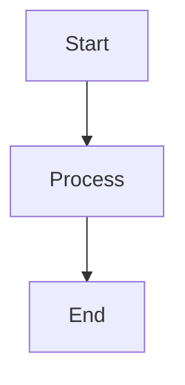
````

## Online Tools and Editors

### Mermaid Live Editor

The fastest way to get started with Mermaid.js is using the official online editor:

**🌐 [Mermaid Live Editor](https://mermaid.live/)** - The official online editor where you can:
- Create and edit diagrams in real-time.
- Export as SVG, PNG, or shareable links.
- Test syntax and see instant previews.
- Share diagrams with colleagues.
- No registration required.

### Alternative Online Tools

**🌐 [Draw.io (now diagrams.net)](https://app.diagrams.net/)** 
- Supports importing Mermaid syntax.
- Rich diagram editor with Mermaid integration.
- Multiple export formats and cloud storage options.

**🌐 [Kroki](https://kroki.io/)**
- Multi-format diagram service that supports Mermaid.
- REST API for automated diagram generation.
- Self-hostable for enterprise use.

### Quick Testing Tools

**Browser Console Testing:**
You can quickly test Mermaid syntax in any browser's developer console:

```javascript
// Open browser console and run:
const mermaidCode = `
graph TD
    A[Test] --> B[Success]
`;
console.log("Mermaid syntax is valid!");
```

**Online Validators:**
- **[Mermaid.js Playground](https://mermaid.js.org/intro/n00b-syntaxReference.html)** - Official syntax reference with examples
- **[JSON to Mermaid Converters](https://github.com/mermaid-js/mermaid/discussions)** - Community tools for data conversion

### Developer Tools and Extensions

#### Visual Studio Code Extensions

**Primary Extension:**
- **[Mermaid Markdown Syntax Highlighting](https://marketplace.visualstudio.com/items?itemName=bpruitt-goddard.mermaid-markdown-syntax-highlighting)** - Syntax highlighting for Mermaid code blocks in Markdown files

**Additional VS Code Extensions:**
- **[Markdown Preview Mermaid Support](https://marketplace.visualstudio.com/items?itemName=bierner.markdown-mermaid)** - Preview Mermaid diagrams directly in VS Code's Markdown preview
- **[Mermaid Preview](https://marketplace.visualstudio.com/items?itemName=vstirbu.vscode-mermaid-preview)** - Dedicated Mermaid preview pane
- **[Draw.io Integration](https://marketplace.visualstudio.com/items?itemName=hediet.vscode-drawio)** - While not Mermaid-specific, supports importing Mermaid diagrams

#### Visual Studio Extensions

**For Visual Studio (Windows):**
- **[Markdown Editor](https://marketplace.visualstudio.com/items?itemName=MadsKristensen.MarkdownEditor)** - Markdown editor with Mermaid diagram support

#### Other Popular Editors

**JetBrains IDEs (IntelliJ, WebStorm, PyCharm):**
- **[Mermaid Plugin](https://plugins.jetbrains.com/plugin/20146-mermaid)** - Native Mermaid support with live preview

**Obsidian:**
- Native Mermaid support built-in for note-taking and knowledge management

**Notion:**
- Native Mermaid code block support

### Browser Extensions

- **[Mermaid Diagrams](https://chrome.google.com/webstore/detail/mermaid-diagrams/phfcghedmopjadpojhmmaffjmfiakfil)** (Chrome) - Render Mermaid diagrams on any webpage

## Comprehensive Diagram Types Guide

### 1. Flowcharts - The Foundation of Process Visualization

Flowcharts are perfect for representing processes, decision trees, and algorithms.

**Basic Syntax:**
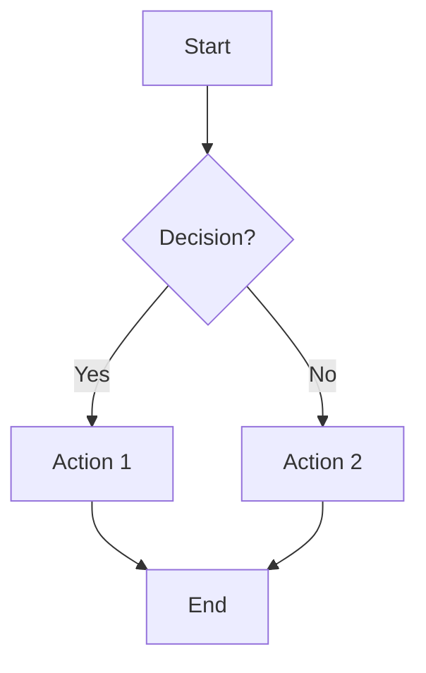

**Advanced Flowchart Example:**
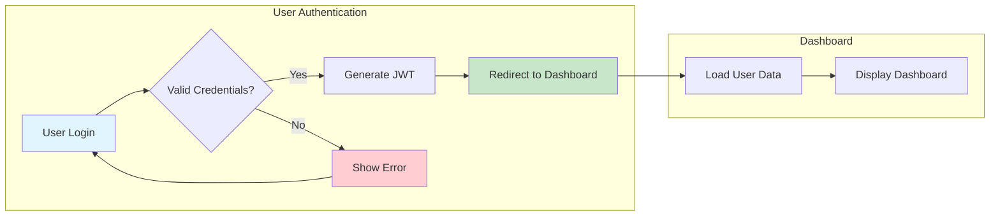

**Key Features:**
- **Direction Control**: `TD` (top-down), `LR` (left-right), `BT` (bottom-top), `RL` (right-left)
- **Node Shapes**: Rectangles `[]`, Circles `()`, Diamonds `{}`, and more
- **Subgraphs**: Group related elements
- **Styling**: Custom colors and themes

### 2. Sequence Diagrams - Visualizing Interactions

Perfect for API documentation, system interactions, and communication flows.

**Basic Example:**
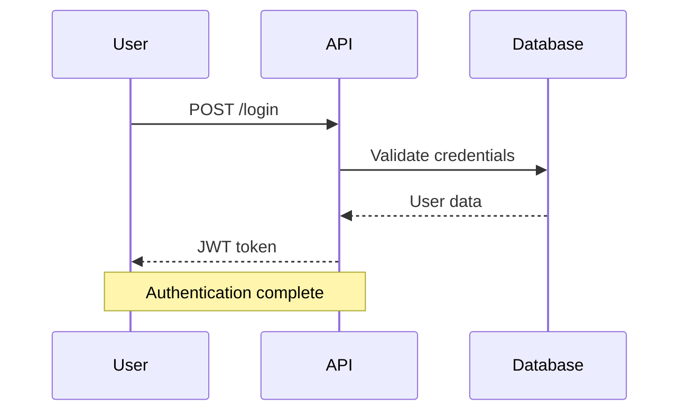

**Advanced Features:**
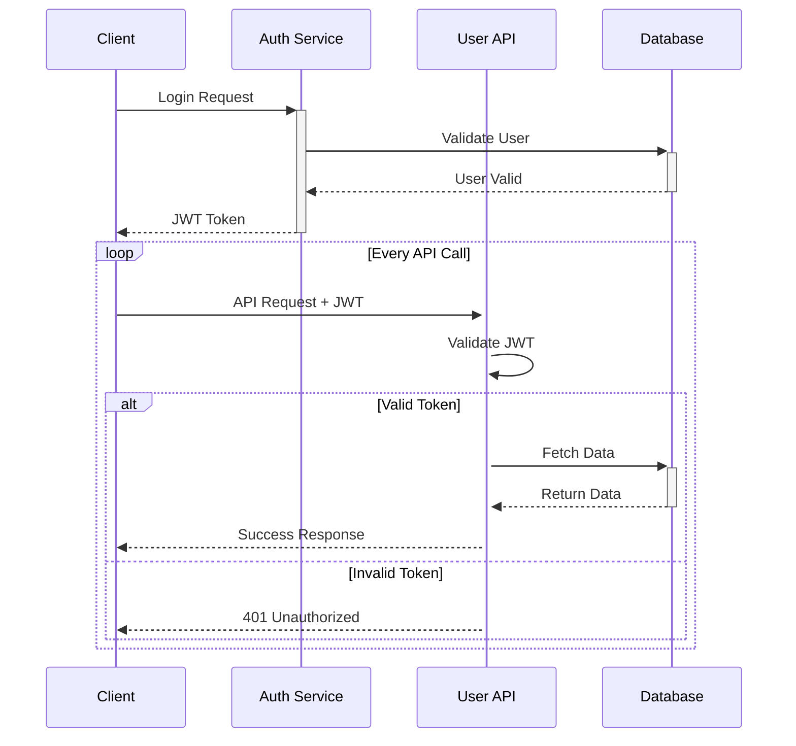

**Key Features:**
- **Activations**: Show when objects are active with `+` and `-`
- **Loops**: Represent repetitive actions
- **Alt/Else**: Handle conditional logic
- **Notes**: Add explanatory comments

### 3. Class Diagrams - Object-Oriented Design

Essential for software architecture and database design documentation.

**Basic Example:**
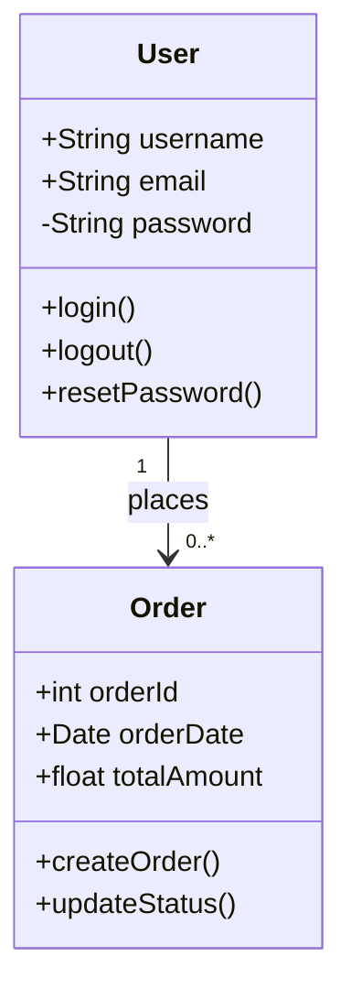

**Advanced Class Diagram:**
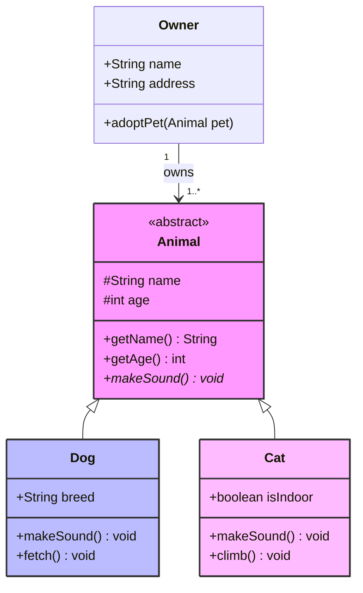

**Key Features:**
- **Visibility**: `+` public, `-` private, `#` protected
- **Relationships**: Inheritance `<|--`, Composition `*--`, Association `-->`
- **Stereotypes**: `<<interface>>`, `<<abstract>>`
- **Multiplicity**: Define cardinality relationships

### 4. Entity Relationship Diagrams (ERD) - Database Design

Perfect for database schema documentation and data modeling.

**E-commerce Database Example:**
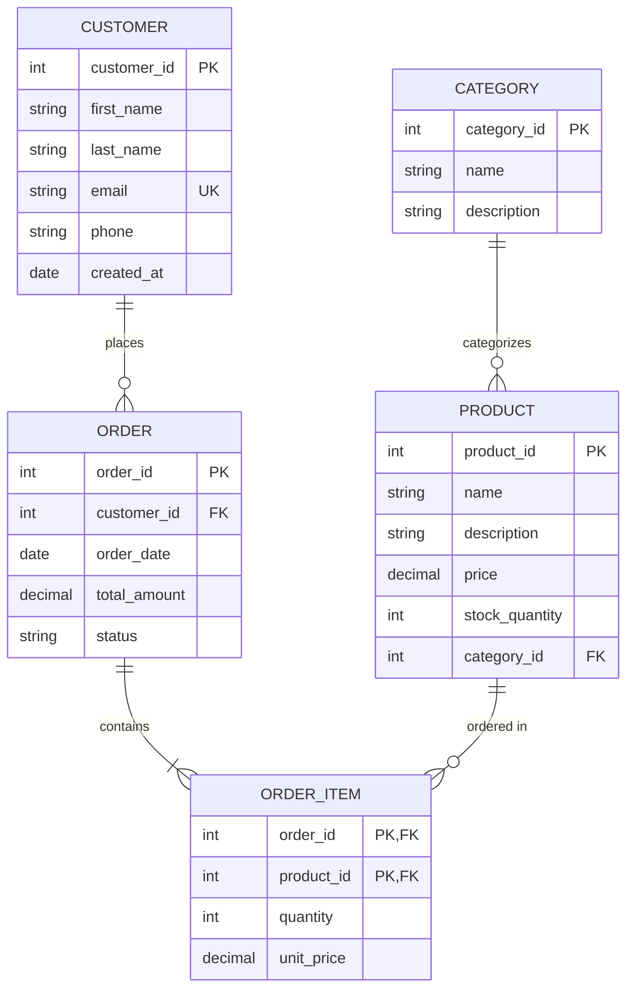

**Key Features:**
- **Cardinality**: `||--||` one-to-one, `||--o{` one-to-many
- **Attributes**: Define data types and constraints
- **Keys**: `PK` primary key, `FK` foreign key, `UK` unique key

### 5. State Diagrams - Process and System States

Ideal for documenting application states, user workflows, and system behavior.

**User Authentication State Machine:**
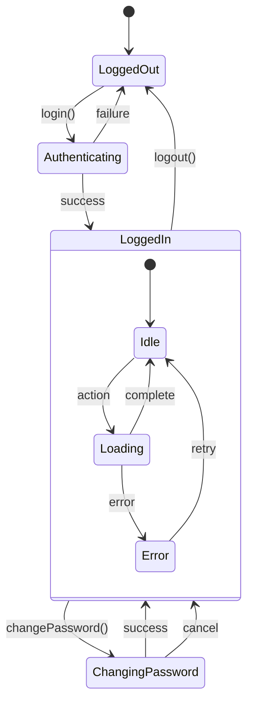

### 6. Git Graphs - Version Control Visualization

Perfect for documenting branching strategies and release workflows.

```mermaid
gitgraph
    commit id: "Initial commit"
    commit id: "Add user authentication"
    
    branch feature/user-profile
    checkout feature/user-profile
    commit id: "Create user model"
    commit id: "Add profile endpoints"
    
    checkout main
    commit id: "Fix security issue"
    
    checkout feature/user-profile
    merge main
    commit id: "Update profile UI"
    
    checkout main
    merge feature/user-profile
    commit id: "Release v1.0"
    
    branch hotfix/critical-bug
    checkout hotfix/critical-bug
    commit id: "Fix critical bug"
    
    checkout main
    merge hotfix/critical-bug
    commit id: "Release v1.0.1"
```

### 7. Gantt Charts - Project Management

Excellent for project timelines and milestone tracking.

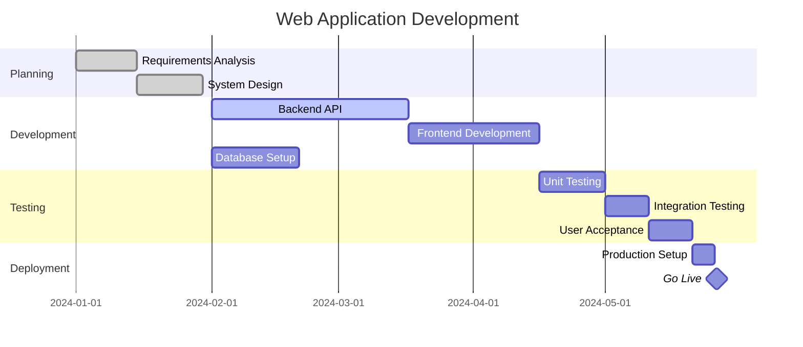

### 8. Pie Charts - Data Visualization

Simple and effective for showing proportions and percentages.

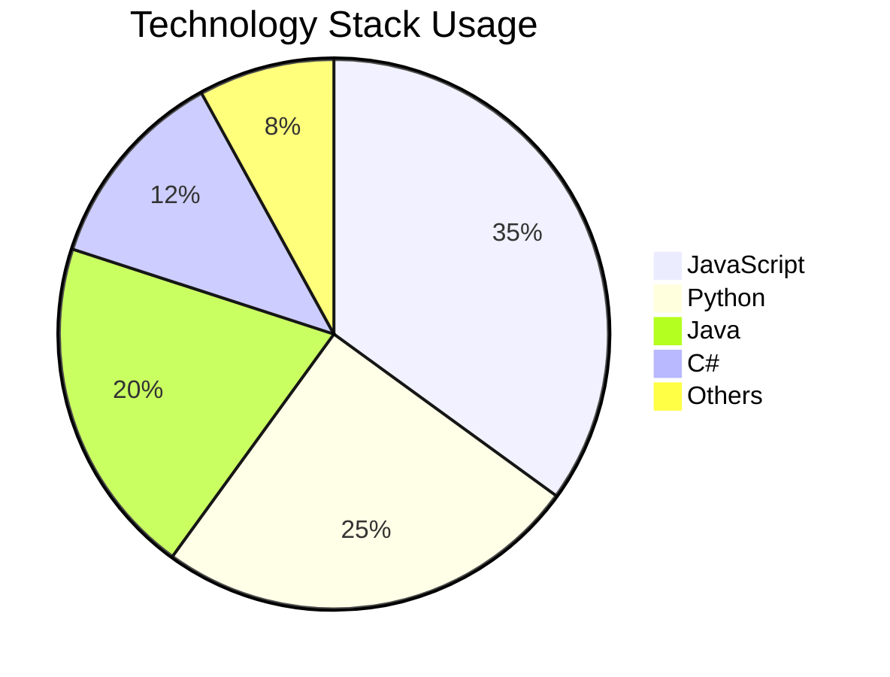

### 9. User Journey - UX Documentation

Perfect for documenting user experience flows and touchpoints.

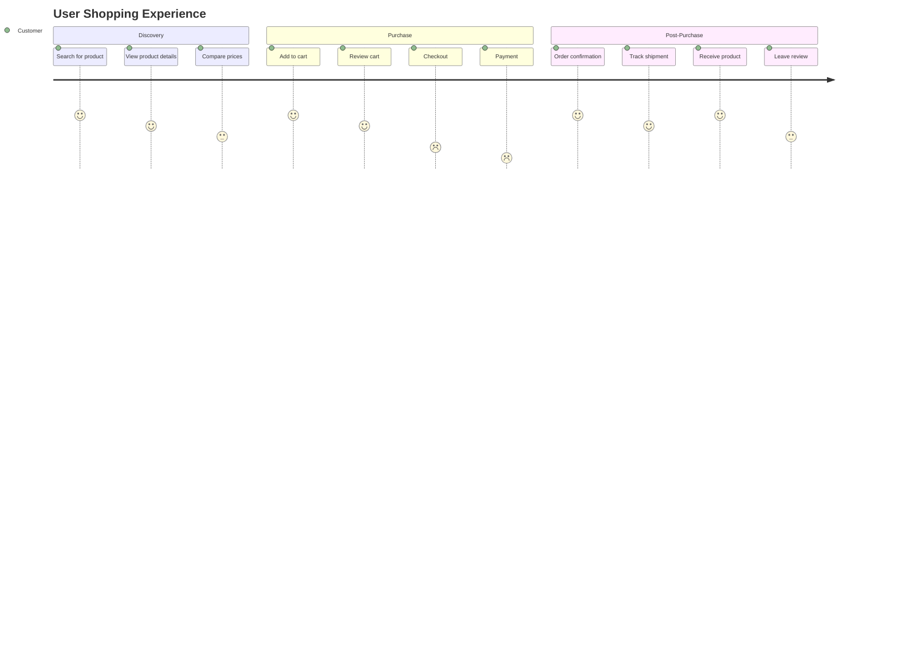

## Advanced Mermaid Features

### Custom Styling and Themes

**Built-in Themes:**


**Custom Styling:**
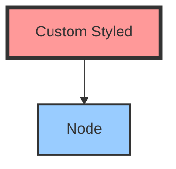

### Interactive Features

**Clickable Links:**
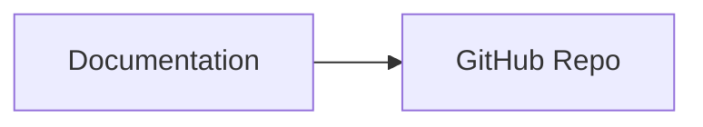

### Configuration Options

```html
<script>
mermaid.initialize({
    startOnLoad: true,
    theme: 'default',
    themeVariables: {
        primaryColor: '#ff6b6b',
        primaryTextColor: '#333',
        primaryBorderColor: '#ff6b6b'
    },
    flowchart: {
        curve: 'linear',
        nodeSpacing: 100,
        rankSpacing: 100
    }
});
</script>
```

## Best Practices for Effective Diagrams

### 1. Keep It Simple
- Start with the essential elements.
- Avoid information overload.
- Use consistent naming conventions.

### 2. Use Meaningful Labels
- Clear, descriptive node names.
- Consistent terminology.
- Avoid technical jargon when unnecessary.

### 3. Leverage Visual Hierarchy
- Use colors strategically.
- Group related elements.
- Highlight critical paths.

### 4. Document Your Diagrams
- Add context with titles and descriptions.
- Include legends when necessary.
- Provide links to detailed documentation.

### 5. Version Control Integration
```markdown
<!-- In your README.md -->
## System Architecture

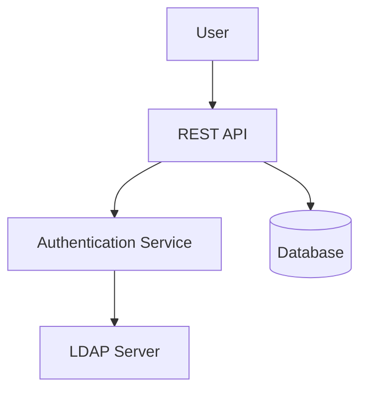

```

## Integration Examples

### GitHub Integration

GitHub natively supports Mermaid diagrams in Markdown files, issues, and pull requests:

````markdown
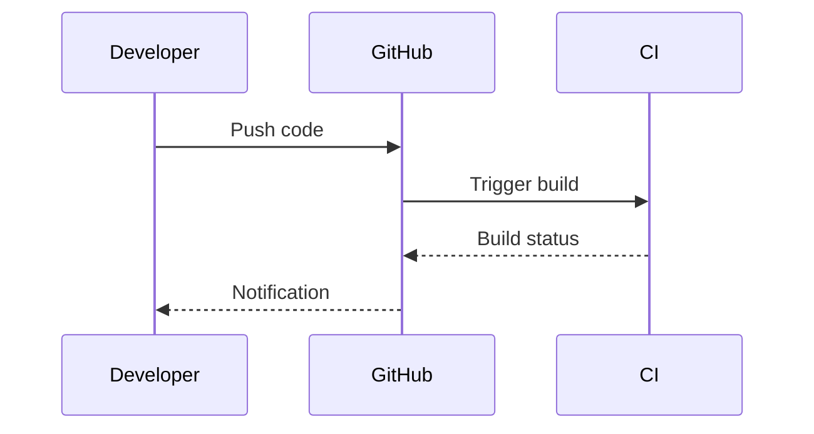
````

### Documentation Platforms

**GitBook, Notion, and Others:**
Most modern documentation platforms support Mermaid through plugins or native integration.

### Development Environment Setup

#### VS Code - Complete Setup Guide

VS Code offers the best Mermaid.js development experience with multiple extensions:

**Essential Extensions:**
1. **[Markdown Preview Mermaid Support](https://marketplace.visualstudio.com/items?itemName=bierner.markdown-mermaid)** 
   - Adds Mermaid rendering to the built-in Markdown preview
   - Install: `ext install bierner.markdown-mermaid`

2. **[Mermaid Markdown Syntax Highlighting](https://marketplace.visualstudio.com/items?itemName=bpruitt-goddard.mermaid-markdown-syntax-highlighting)**
   - Syntax highlighting for Mermaid code blocks
   - Install: `ext install bpruitt-goddard.mermaid-markdown-syntax-highlighting`

**Pro Tips for VS Code:**
- Use `Ctrl+Shift+V` (Windows/Linux) or `Cmd+Shift+V` (Mac) to open Markdown preview
- Split the editor to see code and preview side-by-side
- Use snippets for common diagram patterns

#### Visual Studio (Windows)

**Recommended Extensions:**
- **[Markdown Editor](https://marketplace.visualstudio.com/items?itemName=MadsKristensen.MarkdownEditor)** - Full-featured Markdown editor with Mermaid support
- **[Web Essentials](https://marketplace.visualstudio.com/items?itemName=MadsKristensen.WebEssentials2019)** - Includes various web development tools including diagram support

#### JetBrains IDEs Integration

For **IntelliJ IDEA, WebStorm, PyCharm, and other JetBrains IDEs:**
- **[Mermaid Plugin](https://plugins.jetbrains.com/plugin/20146-mermaid)** - Provides syntax highlighting and live preview
- Enable through: Settings → Plugins → Marketplace → Search "Mermaid"

#### Command Line Tools

**Mermaid CLI:**
```bash
# Install globally
npm install -g @mermaid-js/mermaid-cli

# Generate PNG from Mermaid file
mmdc -i diagram.mmd -o output.png

# Generate SVG
mmdc -i diagram.mmd -o output.svg

# Batch processing
mmdc -i docs/ -o output/ --recursive
```

### Custom Implementations

```javascript
// Dynamic diagram generation
const generateDiagram = (data) => {
    const mermaidCode = `
        flowchart TD
            ${data.map((item, index) => 
                `${index}[${item.name}]`
            ).join('\n')}
            ${data.map((item, index) => 
                item.dependencies?.map(dep => 
                    `${dep} --> ${index}`
                ).join('\n')
            ).filter(Boolean).join('\n')}
    `;
    
    return mermaidCode;
};
```

## Common Pitfalls and Solutions

### 1. Syntax Errors
**Problem:** Diagram doesn't render
**Solution:** Check for typos, missing spaces, and proper syntax

### 2. Performance Issues
**Problem:** Slow rendering with large diagrams
**Solution:** Break complex diagrams into smaller components

### 3. Browser Compatibility
**Problem:** Diagrams don't display in older browsers
**Solution:** Use polyfills or provide fallback images

### 4. Accessibility
**Problem:** Diagrams not accessible to screen readers
**Solution:** Provide text alternatives and proper descriptions

## Real-World Use Cases

### Software Architecture Documentation

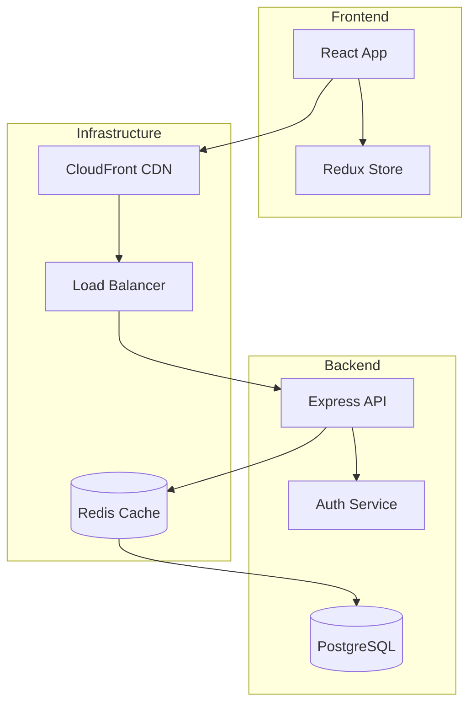

### API Documentation

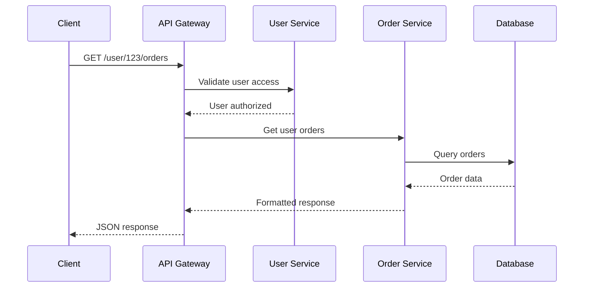

### Database Schema Design

```mermaid
erDiagram
    USER ||--o{ POST : creates
    USER ||--o{ COMMENT : writes
    POST ||--o{ COMMENT : has
    POST }o--|| CATEGORY : belongs_to
    
    USER {
        uuid id PK
        string username UK
        string email UK
        timestamp created_at
    }
    
    POST {
        uuid id PK
        uuid user_id FK
        uuid category_id FK
        string title
        text content
        timestamp created_at
    }
```

## Future of Mermaid.js

Mermaid.js continues to evolve with exciting features on the horizon:

- **Enhanced Themes**: More built-in themes and better customization
- **Interactive Elements**: Improved click handlers and animations
- **Performance Improvements**: Faster rendering for complex diagrams
- **New Diagram Types**: Additional visualization options
- **AI Integration**: Automated diagram generation from descriptions

## Conclusion

Mermaid.js revolutionizes how we create and maintain technical diagrams by treating them as code. This approach brings numerous benefits:

- **Version Control**: Track changes and collaborate effectively
- **Maintenance**: Easy updates without complex design tools
- **Integration**: Seamless integration with development workflows
- **Accessibility**: Text-based format is searchable and screen-reader friendly
- **Consistency**: Standardized styling across all diagrams

Whether you're documenting APIs, designing databases, planning projects, or explaining complex systems, Mermaid.js provides the tools to create professional, maintainable diagrams that enhance understanding and communication.

Start small, experiment with different diagram types, and gradually build your Mermaid.js expertise. Your future self (and your team) will thank you for choosing diagrams as code!

**Ready to get started?** Visit the [official Mermaid.js documentation](https://mermaid.js.org/) and begin transforming your ideas into beautiful, maintainable diagrams today.

---

*Have you used Mermaid.js in your projects? Share your favorite diagram types and use cases in the comments below! And don't forget to check out my other articles on [developer tools](../tags/development) and [documentation best practices](../tags/documentation).*